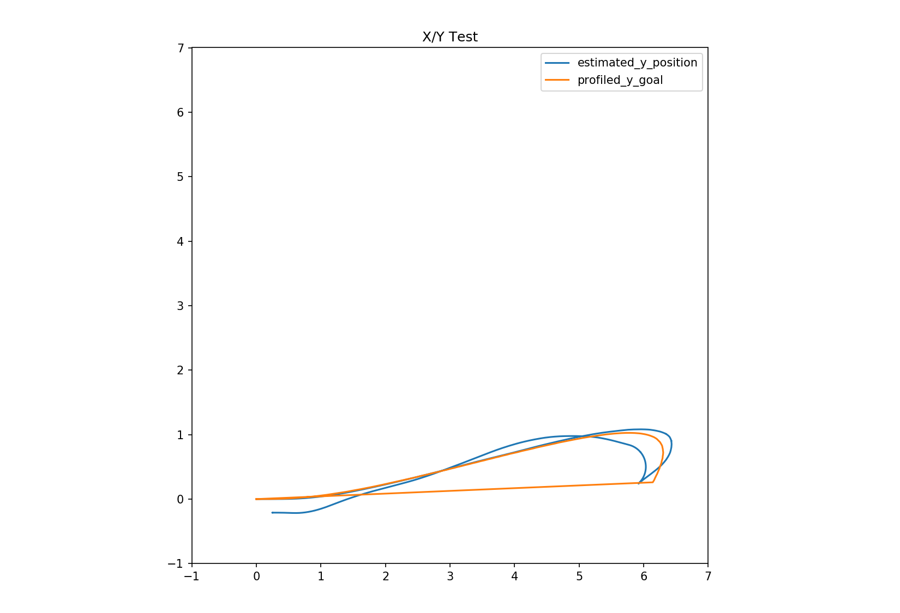

# Overview

The **lime-plotter* application plots data collected from robots in
the First Robotics Competitions and plots them to the screen or to a
PNG file.  It can read data from CSV based log files, or via a
networktables server (IE, from a robot over its wireless network).

# Usage

## Installation

Install any needed modules and the lime-plotter itself:

```
pip3 -r requirements.txt
python3 setup.py build
python3 setup.py install
```

You may wish to run the install pass with the *--user* switch to
install to your personal space.

Plots are specified either via complex command line arguments with the
*-p* switch, or via easier-to-read-and-write YAML configuration files
(see the example below).


# Example configuration

The following are YAML file configuration examples.

The following example configuration file specifies a single plot
called *position* and plots two overlayed graphs from the
robot's *drivetrain_status* table:

``` yaml
plots:
  position:
    - x: estimated_x_position
      y: estimated_y_position
      xmax: 7
      xmin: -7
      ymax: 7
      ymin: -7
      table: drivetrain_status
      fixedAspect: True
      title: X/Y Test
    - x: profiled_x_goal
      y: profiled_y_goal
      table: drivetrain_status
```

Saving this to xy.yml and running lime-plotter.py to load logs from a
*'log'* directory as follows:

    lime-plotter.py -L log -y xy.yml -o xytest.png
	
Might produce the following graph:



