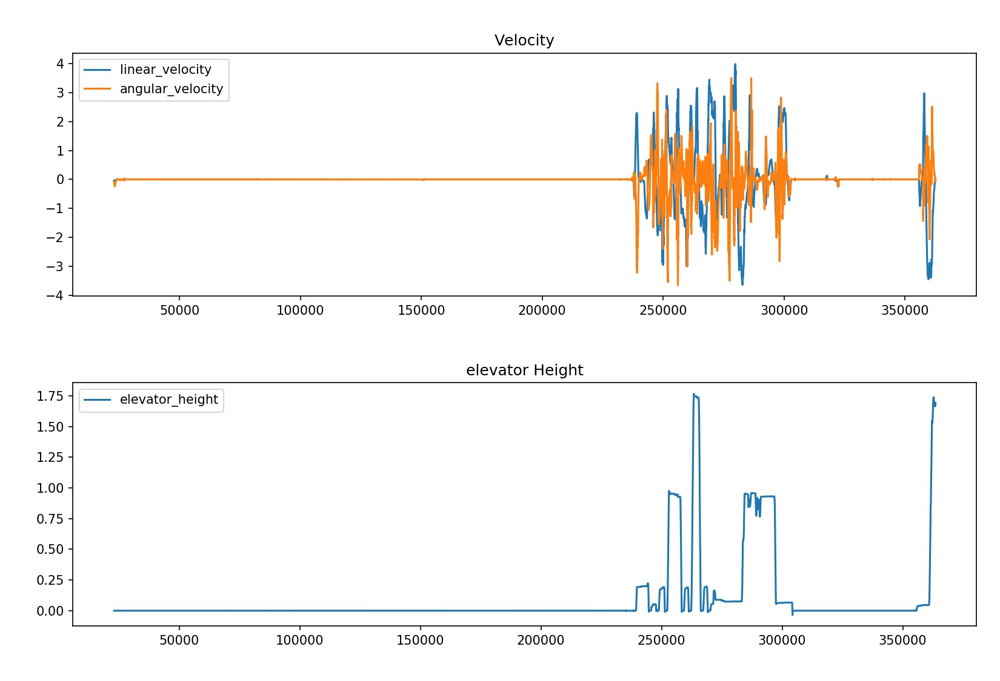

# Overview

The *lime-plotter* application plots data collected from robots in
the First Robotics Competitions and plots them to the screen or to a
PNG file.  It can read data from CSV based log files, or via a
networktables server (IE, from a robot over its wireless network).

# Usage

## Installation

Install any needed modules and the lime-plotter itself:

```
pip3 install --user --upgrade frc1678-lime-plotter
```

Things to plot are specified either via complex command line arguments
with the *-p* switch, or via **easier-to-read-and-write YAML
configuration files** (see the example below).

## Reading from logs

lime-plotter.py can be run with a *-L* switch to load CSV files from a
file, multiple files, or a directory.  EG calling it as:

    lime-plotter.py -L DIR
	
Will load all the files it can from the *DIR* directory.  Table names
will be assumed from the CSV file names.

## Reading from FRC network tables

To read from a network table, use the *-N* switch to specify the
network address to connect to, and optionally a *-T* switch to specify
a default table to read from.

    lime-plotter.py -N 10.0.0.1 -t nettable

## Listing available tables / columns

This works for both NetworkTables and CSV logs:

    lime-plotter.py -N 10.0.0.1 -l

# Example configuration

The following are YAML file configuration examples.

## Example single graph

The following example configuration file specifies a single plot
called *position* and plots two overlayed graphs from the
robot's *drivetrain_status* table:

``` yaml
plots:
  position:
    - x: estimated_x_position
      y: estimated_y_position
      xmax: 7
      xmin: -7
      ymax: 7
      ymin: -7
      table: drivetrain_status
      fixedAspect: True
      title: X/Y Test
    - x: profiled_x_goal
      y: profiled_y_goal
      table: drivetrain_status
      last: 100
```

Saving this to xy.yml and running lime-plotter.py to load logs from a
*'log'* directory as follows:

    lime-plotter.py -L log -y xy.yml -o xytest.png
	
Might produce the following graph:


## Example multiple graphs

To display multiple plots, configuration files can contain multiple
named entries.  Note that in this case the tool will try and find the
right table for you; I.E. you don't need to specify the table or even
x column if you don't wish.

    plots:
      velocity:
        - y: linear_velocity
        - y: angular_velocity
          title: Velocity
      elevator:
        - y: elevator_height
          title: elevator Height

And run with

    lime-plotter.py -L log -y multiple.yml -o multiple.yng
	
Will produce a graph similar to the following:



Note: you can use the -Y flag to plot only a selected set of sections
of the YAML file.  EG `lime-plotter.py -L log -y multiple.yml -Y velocity`
will plot only the first graph.

## Including an svg image (such as a field map)

Can be done with a 'data_source' entry inside a plot:

    plots:
      - data_source: svg
        file: 2020map.svg
        xmax: 629.25 # scale svg to these dimensions
        ymax: 323.25 # (2020 dimensions in inches)
        alpha: .5

Here's a copy of the [FRC 2020 map] as a plottable SVG:

[FRC 2020 map]: ./images/2020map.svg

### Including built in maps

The following map files can be specified without actually having a
file present, as they're included in the package data:

- 2019map.svg
- 2020map.svg      (just the playing field)
- 2020map-rev.svg  (reverses the playing field top to bottom)
- 2020map-full.svg (the full field with human areas)

# Animation

When plotting from *networktables* or with the *-a* switch applied,
a window will open that will animate the data flowing over time (live
in the case of *networktables*).  You can use the *-f* switch to
change the frame rate (when graphing CSV files, it'll draw faster with
higher values -- the default is 20; when drawing from network tables
it'll use this value as the polling frequency, and should be set to
the same number of milliseconds that the robot is using to update tables).

# time markers

You can turn on time markers, that mark bigger dots every N seconds
with configuration like:

```
  timemarkers:
    # plot the regular 
    - x: Robot X
      y: Robot Y
      fixedAspect: true

    # Plot a larger (size 20) dot every 1 second ontop the Robot X/Y marks
    - data_source: timer
      marker_size: 20
      x: Robot X
      y: Robot Y
      delta: 1
```
